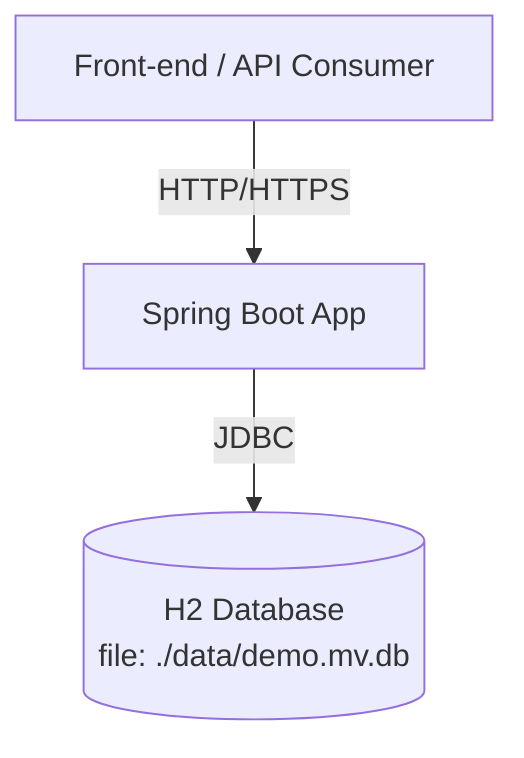

# System Design Specification

## 1. Architecture Overview

### 1.1 High-Level Architecture  
This is a monolithic, client-server web application built with Spring Boot. It exposes a RESTful API and persists data in an embedded H2 database configured in **file mode** to guarantee persistence across server restarts.

### 1.2 Architecture Diagram  


### 1.3 Technology Stack  
- Frontend technologies  
  - (Optional) React / Angular / Vue for UI  
  - HTTP clients (Axios, Fetch)  

- Backend technologies  
  - Java 17+  
  - Spring Boot 3.x  
    - Spring Web (REST)  
    - Spring Data JPA  
    - Spring Security (optional)  
  - Maven or Gradle build system  

- Database systems  
  - H2 (embedded) in **file mode** for persistence  
    - Configuration in `application.properties`:
      ```properties
      spring.datasource.url=jdbc:h2:file:./data/demo;DB_CLOSE_ON_EXIT=FALSE;AUTO_RECONNECT=TRUE
      spring.datasource.username=sa
      spring.datasource.password=
      spring.datasource.driverClassName=org.h2.Driver
      spring.jpa.hibernate.ddl-auto=update
      spring.h2.console.enabled=true
      spring.h2.console.path=/h2-console
      ```
    - Data files stored under `./data/` directory; survives server restarts.

- Third-party services and APIs  
  - (Example) SendGrid / Mailgun for emails  
  - Stripe / PayPal for payments  

- Development tools  
  - IDE: IntelliJ IDEA / VSCode  
  - Git for version control  
  - Docker (for containerization)  
  - Postman / Insomnia for API testing  

---

## 2. Component Design

### 2.1 Frontend Components  
*(Optional; if you have a separate UI)*  
- `AppShell`  
  - Routes requests to feature modules  
- `EntityList`  
  - Fetches and displays a list of entities  
- `EntityForm`  
  - Create/Update form, calls REST endpoints  

### 2.2 Backend Services  
- **DemoApplication**  
  - Spring Boot entry point  

- **Controllers**  
  - `EntityController`  
    - CRUD endpoints under `/api/entities`  
- **Services**  
  - `EntityService`  
    - Business logic, transactional boundaries  
- **Repositories**  
  - `EntityRepository extends JpaRepository<Entity, Long>`  
    - Data access layer  

### 2.3 Database Layer  
- Uses Spring Data JPA for ORM  
- All entities mapped using JPA annotations  
- Data access patterns:  
  - Simple CRUD via `JpaRepository`  
  - Custom queries with `@Query` where needed  
- Connection pooling via HikariCP (default in Spring Boot)  

---

## 3. Data Models

### 3.1 Database Schema  

```sql
-- Example table for a generic entity
CREATE TABLE entity (
    id BIGINT AUTO_INCREMENT PRIMARY KEY,
    name VARCHAR(255) NOT NULL,
    description VARCHAR(1024),
    created_at TIMESTAMP DEFAULT CURRENT_TIMESTAMP,
    updated_at TIMESTAMP DEFAULT CURRENT_TIMESTAMP ON UPDATE CURRENT_TIMESTAMP
);
```

Java Entity example:

```java
@Entity
@Table(name = "entity")
public class Entity {
    @Id
    @GeneratedValue(strategy = GenerationType.IDENTITY)
    private Long id;

    @Column(nullable = false)
    private String name;

    private String description;

    @Column(name = "created_at", updatable = false)
    private Instant createdAt;

    @Column(name = "updated_at")
    private Instant updatedAt;

    // getters/setters, @PrePersist, @PreUpdate hooks...
}
```

### 3.2 Data Flow  
1. Client issues HTTP request to `/api/entities`.  
2. `EntityController` receives and validates input.  
3. Calls `EntityService` methods.  
4. `EntityService` interacts with `EntityRepository`.  
5. JPA translates to SQL against the H2 file-based database.  
6. Result is returned up the stack, serialized to JSON, and sent to the client.

---

## 4. API Design

### 4.1 Endpoints  

| Method | Path                 | Request Body                        | Response Body                        | Auth      |
| ------ | -------------------- | ----------------------------------- | ------------------------------------ | --------- |
| GET    | /api/entities        | —                                   | List\<EntityDTO\>                   | Bearer JWT (optional) |
| GET    | /api/entities/{id}   | —                                   | EntityDTO                           | Bearer JWT |
| POST   | /api/entities        | { name: string, description?: string } | EntityDTO                         | Bearer JWT |
| PUT    | /api/entities/{id}   | { name?: string, description?: string } | EntityDTO                         | Bearer JWT |
| DELETE | /api/entities/{id}   | —                                   | 204 No Content                      | Bearer JWT |

Example POST:

```http
POST /api/entities
Content-Type: application/json
Authorization: Bearer <token>

{
  "name": "Sample",
  "description": "This is a demo."
}
```

Response:

```json
{
  "id": 1,
  "name": "Sample",
  "description": "This is a demo.",
  "createdAt": "2024-07-01T12:34:56Z",
  "updatedAt": "2024-07-01T12:34:56Z"
}
```

### 4.2 API Patterns  
- RESTful conventions with proper use of HTTP verbs and status codes  
- JSON payloads; content negotiation via `Accept`/`Content-Type`  
- Optional: GraphQL layer using Spring for GraphQL  
- Optional: WebSocket endpoints for real-time updates  

---

## 5. Security Design

### 5.1 Authentication Strategy  
- JWT-based authentication  
- Users log in via `/api/auth/login` (returns token)  
- Tokens stored client-side (e.g., localStorage)  
- Spring Security filters validate tokens on each request

### 5.2 Authorization  
- Role-Based Access Control (RBAC)  
  - Roles: `ROLE_USER`, `ROLE_ADMIN`  
  - Method-level security via `@PreAuthorize("hasRole('ADMIN')")`  

### 5.3 Data Protection  
- Transport: enforce HTTPS in production  
- At rest: H2 file is local filesystem; for production, use a managed RDBMS with TDE  
- Input validation via Bean Validation (`@Valid`) and custom validators  
- Protect against SQL injection (JPA parameter binding) and XSS  

---

## 6. Integration Points

### 6.1 External Services  
- **Email Service**  
  - SendGrid API for transactional emails  
- **Payment Processor**  
  - Stripe integration via official SDK  
- **Cloud Storage**  
  - AWS S3 for file uploads  

### 6.2 Internal Integrations  
- Synchronous HTTP between micro-frontends (if any)  
- Asynchronous messaging with RabbitMQ / Kafka (future scope)  

---

## 7. Performance Considerations

### 7.1 Optimization Strategies  
- Caching  
  - Use Redis for frequently read data  
  - @Cacheable on service methods  
- Database indexing  
  - Index `name` column if used in search queries  
- Query optimization  
  - Avoid N+1 selects with `fetch join`  
- Lazy loading and code splitting in frontend  

### 7.2 Scalability  
- Horizontal scaling of stateless Spring Boot instances behind an ELB  
- H2 is fine for development; migrate to PostgreSQL / MySQL for production  
- Database sharding or read-replicas as needed  

---

## 8. Error Handling and Logging

### 8.1 Error Handling Strategy  
- Global exception handler with `@ControllerAdvice`  
- Standard error response payload:
  ```json
  { "timestamp":"...","status":400,"error":"Bad Request","message":"Validation failed","path":"/api/entities" }
  ```
- Retry mechanisms for transient failures (e.g., external API calls)

### 8.2 Logging and Monitoring  
- SLF4J + Logback  
- Correlation IDs for request tracing  
- Log aggregation with ELK (Elasticsearch, Logstash, Kibana) or Splunk  
- APM: New Relic / Datadog for performance metrics  

---

## 9. Development Workflow

### 9.1 Project Structure  
```
src/
├── main/
│   ├── java/com/frida/example/demo
│   │   ├── DemoApplication.java
│   │   ├── controller/
│   │   ├── service/
│   │   ├── repository/
│   │   └── model/
│   └── resources/
│       ├── application.properties
│       └── data/            ← H2 database files
└── test/
    └── java/…
```

### 9.2 Development Environment  
- Java 17+, Maven/Gradle  
- Local H2 console at `http://localhost:8080/h2-console`  
- Environment variables:
  - `SPRING_DATASOURCE_URL`
  - `SPRING_PROFILES_ACTIVE=dev|staging|prod`

### 9.3 Testing Strategy  
- Unit tests with JUnit 5, Mockito  
- Integration tests with Spring Boot Test & Testcontainers (for PostgreSQL)  
- E2E tests with Cypress / Selenium  
- Aim for ≥ 80% coverage  

---

## 10. Deployment Architecture

### 10.1 Deployment Strategy  
- CI/CD via GitHub Actions / GitLab CI / Jenkins  
- Pipelines:
  1. Build & unit tests  
  2. Integration tests  
  3. Build Docker image  
  4. Push to registry  
  5. Deploy to environments (dev → staging → prod)

### 10.2 Infrastructure  
- Hosting: AWS (ECS/EKS) or Kubernetes cluster  
- Containerization: Docker, Kubernetes manifests or Helm charts  
- Database hosting:  
  - Dev: embedded H2 (file-mode)  
  - Prod: Amazon RDS (PostgreSQL/MySQL)  
- Use a volume (EBS) to persist H2 files if you containerize dev environment  

---

**Answer to your H2 persistence question**  
To prevent H2 in-memory data from being lost upon server restart, configure it in **file mode** by setting in `application.properties`:

```properties
spring.datasource.url=jdbc:h2:file:./data/demo;DB_CLOSE_ON_EXIT=FALSE;AUTO_RECONNECT=TRUE
spring.jpa.hibernate.ddl-auto=update
```

This writes the database to `./data/demo.mv.db` on disk. On each restart, Spring Boot will reconnect to that file and your data will persist.